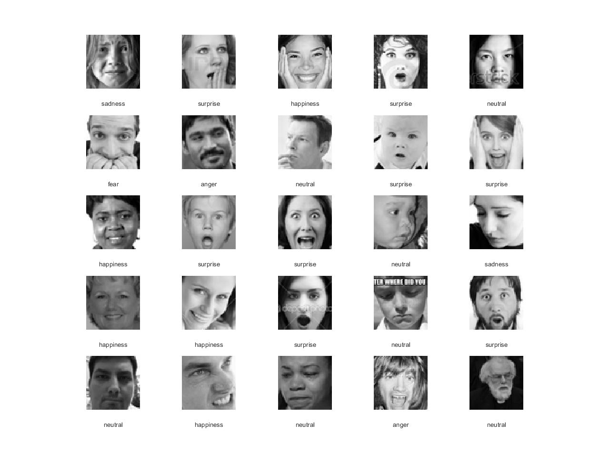

# Emotion recognition

_A deep learning neural network to detect emotion from face images._

This repository uses the [FER+ dataset](https://github.com/Microsoft/FERPlus) to train an emotion recognition network using the [MATLAB deep learning toolbox](https://www.mathworks.com/products/neural-network.html).

TODO scripted example



## Usage

### Classification only

A pre-trained model is available to download here TODO.

To use this model for classification simple load the model then use the classify method. Make sure you resize your image to be a 48 x 48 grayscale.

```matlab
% Load the network
load('C:/Downloads/emotionNet-v1.mat', 'emotionNet');

% Load the image
im = imread('C:/Data/example.jpg');
inputImage = rgb2gray(imresize(im, [48, 48]));

% Make a prediction
prediction = emotionNet.classify(inputImage);
```

### Training

TODO

- download and extract [ferPlus csv](https://github.com/Microsoft/FERPlus)
- download [fer2013 csv](https://www.kaggle.com/c/challenges-in-representation-learning-facial-expression-recognition-challenge/data)
- place both in `data/` directory
- run fer2013Plusprep.m

## Results

TODO

Using the multiple labels from the FER+ dataset indicates human accuracy would be about 84%. Training a quick model based on the original paper gets to 83% accuracy on the validation set.
